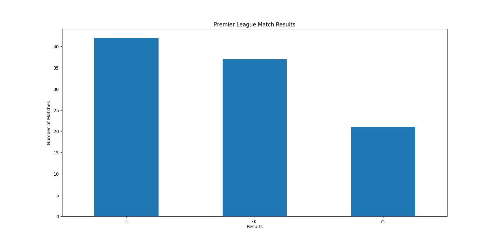
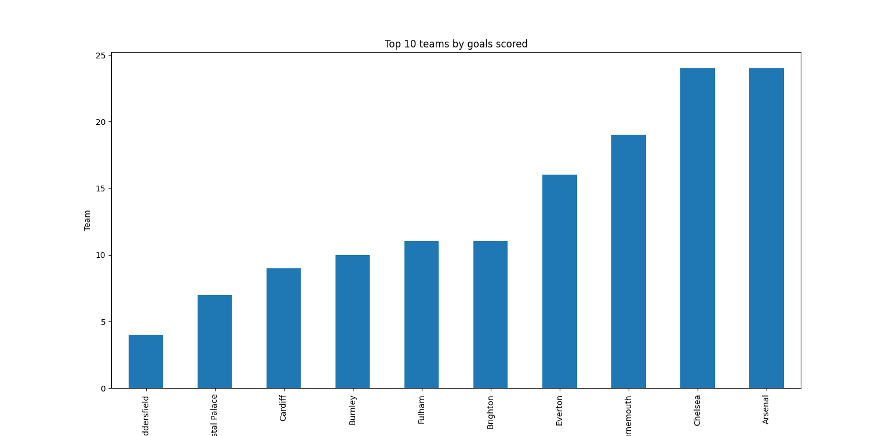

# Premier League 2018-2019 Data Analysis with Python


## Project Overview


The project analyses Football match results data belonging to the English Premier League for the season 2018-2019 using Python.


The project uses Pandas and Matplotlib libraries for analysing and visualizing the data related to goals, shots, corners, fouls and cards.

## What we'll do


1. Analyze Premier League results

2. Find total and average goals

3. Find highest goal scoring matches

4. Compare home win, away win and draws

5. Analyze goals of each team

6. Make league table


## Technologies

1. Python

2. Pandas

3. Matplotlib

4. CSV

## Dataset

The dataset contains:

1. Date

2. Home Team

3. Away Team

4. Full time goals

5. Half time goals

6. Match result

7. Shots

8. Shots on target

9. Fouls

10. Corners

11. Yellow cards

12. Red cards

13. Referee


## How To Run

Install the following libraries:

```

pip install pandas matplotlib

```

Run the following command:

```

python premier_league_analysis.py

```

## Analysis

### Match Results

Analyzing:

1. Home win percentage

2. Away win percentage

3. Draw percentage

### Goals

1. Total goals

2. Average goals

3. Highest goal scoring matches

4. Goals per team

### League Table

Calculations used:

1. Win: 3 Points

2. Draw: 1 Point

3. Loss: 0 Point

Goal Difference: Goals For - Goals Against


## Output
### Match Results



### Top Goal Scoring Teams




## Conclusion

The above project shows how we can perform data analysis and visualization on football match results belonging to the English Premier League using Python.

The project helps in gaining hands-on experience with data-loading, data-cleaning, data-grouping, data-sorting, data-visualization and many more concepts of Python.

## What to do next

1. Perform player level data analysis

2. Compare multiple premier league seasons

3. Compare performances of teams at home and away

4. Compare shots and goals

5. Make a dashboard

6. Make a machine learning model to predict match results


## Author


MST. SANJIDA AKTER